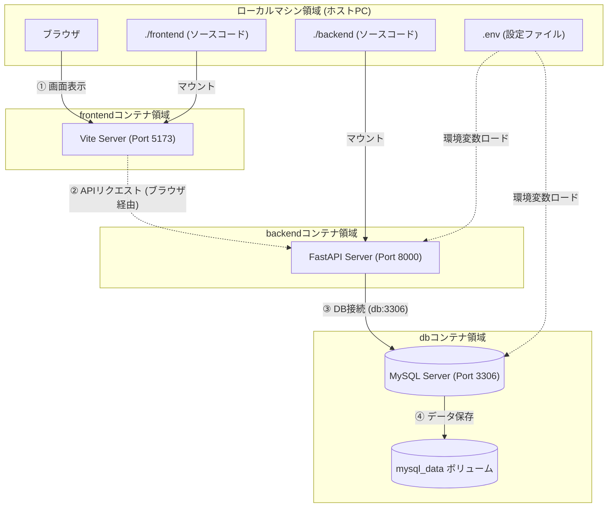

# Dockerを用いた，環境差分をなくした環境構築

- コンテナを作成して，ローカル差分をなくすことで，環境の構築を素早く行うことができる．

## 作成するコンテナ

### dbコンテナ

- イメージ: mysql:8.0
- ポート番号: 3306
- データベースの保存先: /var/lib/mysql
  - "mysql_data"と名前を付けて，永続化（再起動してもデータが残る）

### backendコンテナ

- イメージ: python:3.14.6-slim
- ポート番号: 8000

### frontendコンテナ

- イメージ: node:20-alpine
- ポート番号: 5173

## docker-compose.yamlとDockerfileの違い

- docker-compose.yaml: 複数コンテナの連携，コンテナ自体の設定
- Dockerfile: 1コンテナ分の設定

## Dockerのコンテナ構成図



1. 画面表示（ブラウザ）
2. APIリクエスト（ブラウザ経由）
3. DB接続（DBコンテナ経由）
4. データ保存（mysql_data ボリューム経由）

## 初回セットアップ手順

### 1. Dockerコンテナの起動

```bash
# Dockerコンテナの起動(初回は--buildも必要)
docker compose up -d --build
```

#### その他のDockerコンテナに関するコマンド

```bash
# 停止
docker compose down

# 再起動
docker compose restart

# ログの確認
docker compose logs

# ログの確認(リアルタイム)
docker compose logs -f

# ステータスの確認
docker compose ps

# docker コンテナを落とす
docker compose down

# ビルドキャッシュ削除
docker builder prune --all

# 念のため --no-cache オプションを付けてビルド
docker compose build --no-cache

# コンテナを再起動
docker compose up -d
```

### 2. 各コンテナのバージョン確認コマンド

- 起動後に，正常に起動したことを確認するために，各コンテナのバージョンを確認する．

#### a. データベース (MySQL) のバージョン確認

```bash
docker compose exec db mysql --version
```

#### b. バックエンド (Python) のバージョン確認

```bash
docker compose exec backend python --version
```

#### c. フロントエンド (Node.js) のバージョン確認

```bash
docker compose exec frontend node --version
```

#### other. 各コンテナに直接入るとき

```bash
# dbコンテナ
docker compose exec db bash
mysql -u root -p # パスワードの入力

# backendコンテナ
docker compose exec backend bash

# frontendコンテナ
docker compose exec frontend sh
```

### 3. データベースのテーブル作成

```bash
# backendコンテナにアクセスして，データベースの読み込みを行う
docker compose exec backend python database/scripts/init_db.py

# ジオコーディングデータ等のCSVデータインポート
docker compose exec backend python database/scripts/import_data.py
```

## 各コンテナのポート番号

| サービス | コンテナ内ポート | ホストPCからのアクセスURL / 接続先 |
| :--- | :--- | :--- |
| **フロントエンド** (Vite + React + TS) | `5173` | [http://localhost:5173](http://localhost:5173) |
| **バックエンド** (FastAPI) | `8000` | [http://localhost:8000](http://localhost:8000) (API仕様書: [ファイル作成後に追記]) |
| **データベース** (MySQL) | `3306` | ホスト: `localhost` / ポート: `3306`（`.env` の `MYSQL_PORT` に従う） |
