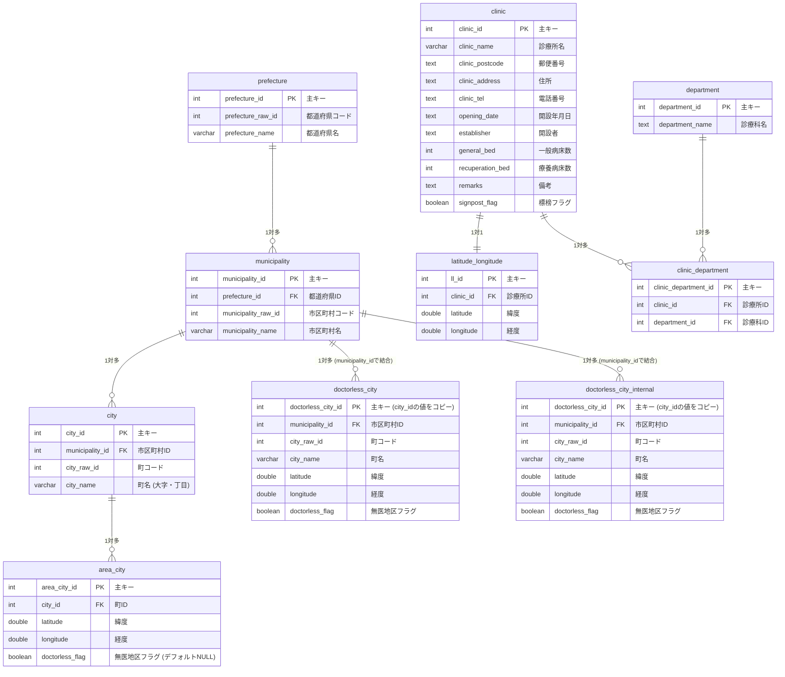
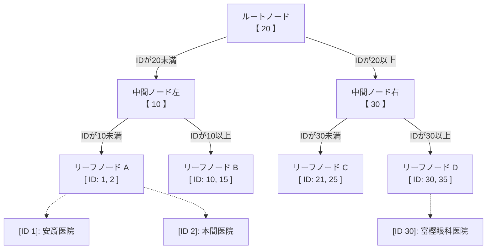

# データベースセットアップ手順書

本システムで利用するMySQLデータベースの構築，初期データのインポート，およびインデックスによる検索高速化の構造について説明します．

---

## 1. データベースのER図（テーブル設計）

システムのデータベース全体の構造およびリレーションシップ（関連性）は以下の通りです．



---

## 2. データベースのセットアップ手順

データベースの初期化とデータのインポートは，Dockerコンテナが起動した状態で以下の手順に従って実行してください．

### Step 1: データベーステーブルの作成（初期化）
SQLAlchemyのモデル定義に基づいて，空のテーブル群を作成します．
```bash
docker compose exec backend python database/scripts/init_db.py
```

### Step 2: 基礎データ（診療所・ジオコーディングデータ）のインポート
マスタデータである診療所データおよび経緯度データをCSVファイルからインポートします．
```bash
docker compose exec backend python database/scripts/import_data.py
```

### Step 3: 無医地区データのインポート
追加機能となる無医地区に関連する地理データをインポートします．
```bash
docker compose exec backend python database/scripts/import_doctorless_area.py
```

### Step 3.5: 無医地区（市区町村）データのインポート
無医地区を市区町村レベルで集約管理する追加データをインポートします．
```bash
docker compose exec backend python database/scripts/import_doctorless_city.py
```

### Step 3.6: 無医地区（内科用市区町村）データのインポート
内科用の無医地区データをインポートします．
```bash
docker compose exec backend python database/scripts/import_doctorless_city_internal.py
```

### Step 4: データの整合性検証
インポートされたデータ件数やリレーションシップが正しいかを自動検証スクリプトでチェックします．
```bash
docker compose exec backend python database/scripts/verify_doctorless_area.py
```

---

## 3. データベースの再構築・初期化手順（スキーマ変更時など）

データベースの構造（`models.py`）に変更を加え，既存のデータベースにそれを強制適用したい場合（例：インデックスの追加やカラムの追加時）は，一度データベースを初期化する必要があります．

以下のいずれかの方法で再構築を行ってください．

### 方法A: Dockerボリュームごとリセットして再構築する
データ保存用のボリュームを完全に消去してクリアな状態から再構築します．

```bash
# 1. コンテナを停止し，ボリューム(データ領域)も一緒に削除する
docker compose down -v

# 2. コンテナを再起動する
docker compose up -d

# 3. テーブルの再作成とデータのインポートを行う
docker compose exec backend python database/scripts/init_db.py
docker compose exec backend python database/scripts/import_data.py
docker compose exec backend python database/scripts/import_doctorless_area.py
docker compose exec backend python database/scripts/import_doctorless_city.py
docker compose exec backend python database/scripts/import_doctorless_city_internal.py
```

### 方法B: コンテナは起動したまま，データベースだけ再作成する
コンテナを停止せずに，データベースのみを削除・再作成して素早く再適用します．

```bash
# 1. データベースを削除して再作成する
docker compose exec db mysql -u root -ppass -e "DROP DATABASE clinic; CREATE DATABASE clinic;"

# 2. テーブルの作成とデータのインポートを行う
docker compose exec backend python database/scripts/init_db.py
docker compose exec backend python database/scripts/import_data.py
docker compose exec backend python database/scripts/import_doctorless_area.py
docker compose exec backend python database/scripts/import_doctorless_city.py
docker compose exec backend python database/scripts/import_doctorless_city_internal.py
```

---

## 4. データベース・インデックス（INDEX）の仕組みと高速化の理由

本システムでは，検索やテーブル結合（JOIN）のパフォーマンスを最大化するために，特定のカラムに**インデックス（INDEX）**を設定しています．

### インデックスの追加理由

インデックスがない場合，データベースは条件に一致するレコードを見つけるために，テーブルの先頭から最後まですべての行をチェックする必要があります（これを **フルテーブルスキャン** と呼びます）．これはデータ量（$N$）が増えるほど比例して時間がかかります（計算量：$O(N)$）．

一方，インデックスを設定すると，データベース内部に **B+ツリー（B+ Tree）** と呼ばれる探索用のツリー構造が自動的に構築されます．

#### B+ツリーによる高速探索のイメージ（例: `clinic_id` で検索する場合）

IDが「2」である「本間医院」を検索する場合を例にします．



### 探索のステップ（IDが「2」を検索する場合）
1. **ルートノードでの判定**: 検索対象のID `2` は「20未満」であるため，**中間ノード左**へ進みます（右側のデータはすべて探索対象から外れます）．
2. **中間ノードでの判定**: ID `2` は「10未満」であるため，**リーフノードA**へ進みます．
3. **リーフノードでの取得**: リーフノードAには `[ID: 1, 2]` のポインタが入っているため，直接 `ID 2` である「本間医院」のデータ行へアクセスします．

### インデックスのメリット
1. **探索時間の短縮 ($O(\log N)$)**: 
   全データを走査するのではなく，ツリーを上から順に辿るだけで目的のデータを見つけられるため，データ量が100万件になってもわずか数回のステップで検索が完了します．
2. **結合（JOIN）の高速化**: 
   `clinic_department` のように外部キー（`clinic_id` や `department_id`）を使って複数のテーブルを繋ぎ合わせる際，結合相手のデータをインデックスを使って瞬時に見つけられるため，処理効率が劇的に向上します．
