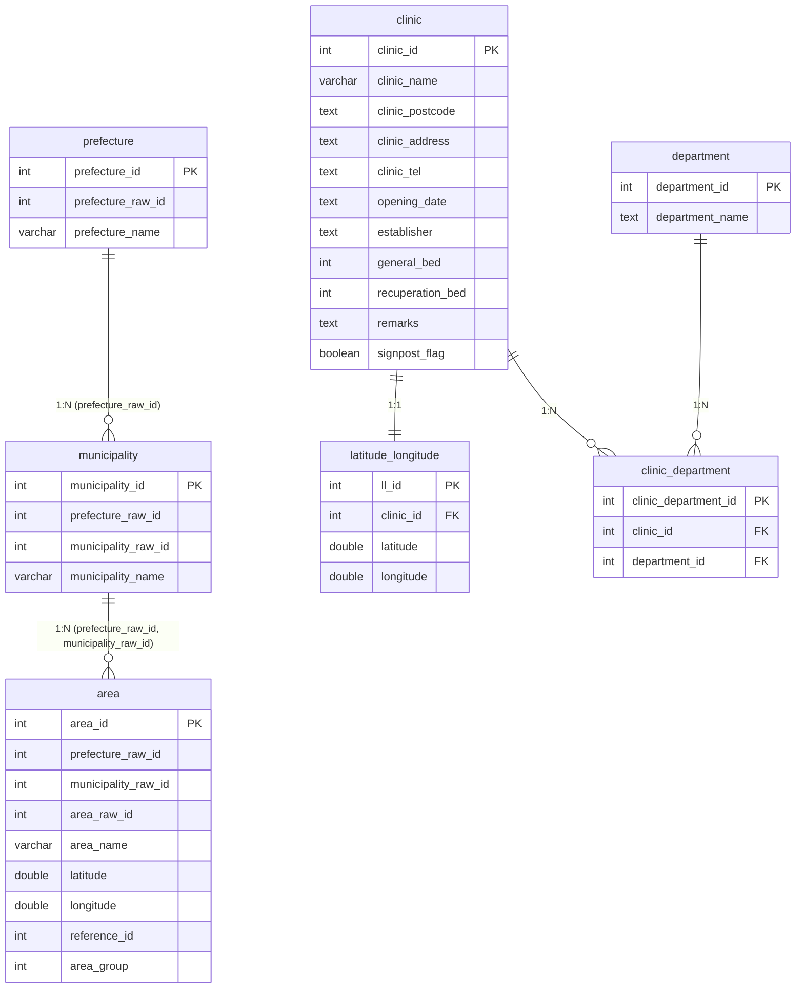

# 無医地区データのデータベース格納手順と検証方法

- `doctorless_area` ディレクトリにある無医地区データをデータベース（MySQL）にインポートし，検証するための手順書です．

## 1. 元データと変換方法

元データである単一のフラットなCSVファイルから，関係データベースに適合するようにデータを正規化・分割して格納しています．

- **元データファイル**: `backend/data/doctorless_area/_15_2025.csv` (文字コード: `CP932/Shift_JIS`)
  - 国土交通省の「街区レベル位置参照情報」を基に作成された，新潟県の地名と座標情報を含むデータです．
- **分割と正規化の流れ**:
  1. **都道府県データの抽出**: 元データの `都道府県コード` と `都道府県名` から一意なペアを抽出し，`prefectures.csv`（UTF-8）に分割しました．
  2. **市区町村データの抽出**: 元データの `都道府県コード`，`市区町村コード`，`市区町村名` から重複を除いて抽出し，`municipalities.csv`（UTF-8）に分割しました．
  3. **地区（大字町丁目）データの抽出**: 元データの `大字町丁目コード`，`大字町丁目名`，`緯度`，`経度`，`原典資料コード`，`区分コード` などを抽出し，`area.csv`（UTF-8）に分割しました．

## 2. データベースのER図

変更後のデータベース（MySQL）のテーブル構造とリレーションシップは以下の通りです．



## 3. 今回の変更点

- **データベースモデルの追加**: `backend/database/utils/models.py` に `Prefecture`（都道府県），`Municipality`（市区町村），`Area`（地区）モデルを定義しました．
  - 緯度経度情報の小数点以下の精度（6桁以上）を正確に保持するため，`latitude` と `longitude` カラムには `Double` 型を採用しています．
- **初期化スクリプトの調整**: `backend/database/scripts/init_db.py` 実行時に既存のクリニック等のテーブルを削除しないよう `drop_all` を削除し，新規テーブルのみを安全に追加作成するようにしました．
- **インポートスクリプトの実装**: `backend/database/scripts/import_doctorless_area.py` を実装し，無医地区データ（都道府県，市区町村，地区）のみを一度クリアしてCSVデータから登録し直す仕組みとしました．
- **整合性検証スクリプトの作成**: `backend/database/scripts/verify_doctorless_area.py` を作成し，DB内のデータとCP932（Shift_JIS）の元データである `_15_2025.csv` が完全に合致しているかを検証できるようにしました．

## 4. 事前準備 (最新状態への更新)

データベースの更新作業を行う前に，ローカル環境のリポジトリを最新の状態に更新してください．

```bash
# リモートリポジトリの最新のメタデータを取得
git fetch

# 現在の作業ブランチにリモートの最新の変更をマージ (※ <ブランチ名> には作業中のブランチ名を指定してください)
git merge origin/<ブランチ名>
```

## 5. データベーステーブルの作成

モデル定義に基づいて，データベース内に自動で新規テーブルを作成します．
※ Dockerコンテナが起動している状態で実行してください．

```bash
# テーブルの追加作成
docker compose exec backend python database/scripts/init_db.py
```

## 6. データのインポート

無医地区データのCSVファイルからデータをデータベースにインポートします．
※ 既存の無医地区関連テーブルデータ（`prefecture`，`municipality`，`area`）は一旦削除され，再登録されます．他のクリニック等のデータには影響しません．

```bash
# インポート処理の実行
docker compose exec backend python database/scripts/import_doctorless_area.py
```

## 7. データの整合性検証方法

データベースに格納されたデータが，元データ（`_15_2025.csv`）と一致しているか検証するスクリプトを実行します．

```bash
# 検証スクリプトの実行
docker compose exec backend python database/scripts/verify_doctorless_area.py
```

### 検証成功時の出力

```text
データベースからインポートされたデータを取得中...
DB登録数 - 都道府県: 1, 市区町村: 37, 地区: 7277
元データ (CSV) との照合を開始します...

--- 照合結果 ---
CSV総行数: 7277
不一致レコード数: 0
未登録の都道府県: 0
未登録の市区町村: 0
未登録の地区: 0
検証成功
```
