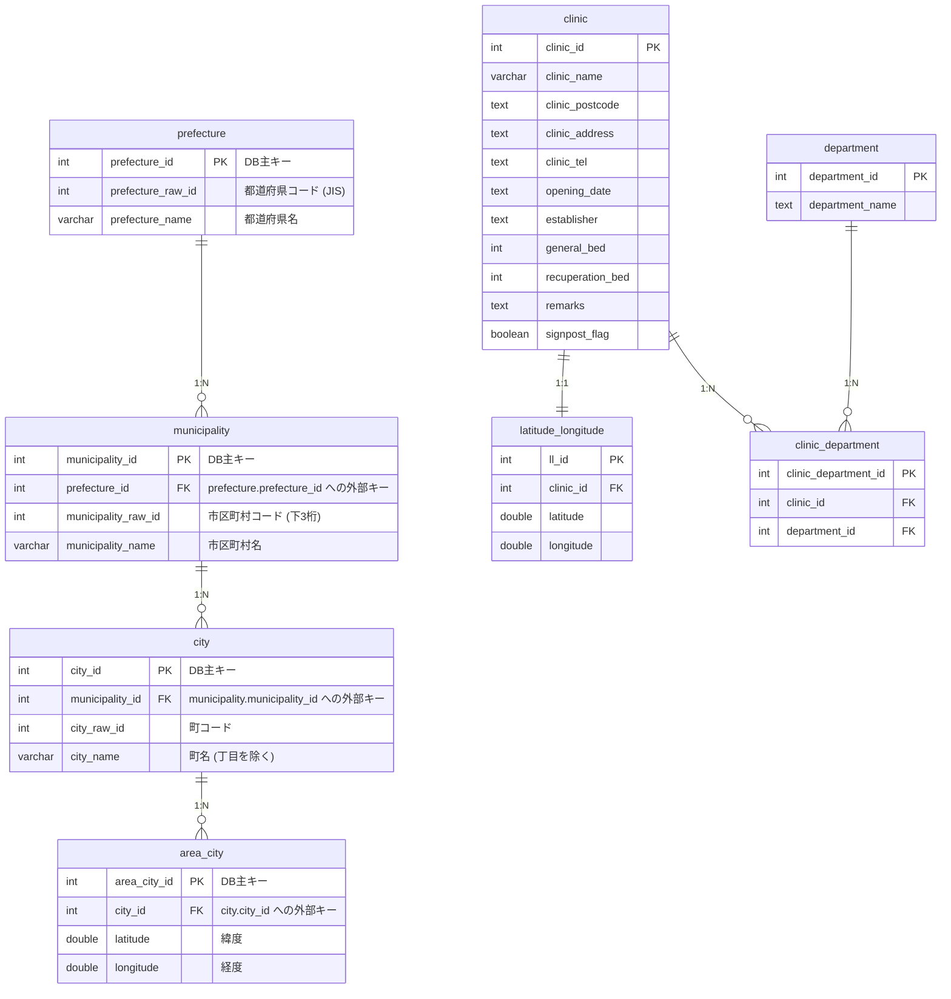

# 無医地区データのデータベース格納手順と検証方法
- `doctorless_area` ディレクトリにある無医地区データをデータベース（MySQL）にインポートし，検証するための手順書です．

## 1. 元データと変換方法
元データである単一のフラットなCSVファイルから，関係データベースに適合するようにデータを正規化・分割して格納しています．

- **元データファイル**: `backend/data/doctorless_area/_15_2025.csv` (文字コード: `CP932/Shift_JIS`)
  - 国土交通省の「街区レベル位置参照情報」を基に作成された，新潟県の地名と座標情報を含むデータです．
- **分割と正規化の流れ**:
  1. **都道府県データの抽出**: 元データの `都道府県コード` と `都道府県名` から一意なペアを抽出し，`prefectures.csv`（UTF-8）に分割してDB上の `prefecture` に登録します．
  2. **市区町村データの抽出**: 元データの `都道府県コード`，`市区町村コード`，`市区町村名` から重複を除いて抽出し，`municipalities.csv`（UTF-8）に分割して `prefecture_id`（外部キー）に紐づけて `municipality` に登録します．
  3. **地区（大字町丁目）データの抽出**: `area_raw_id // 1000` を町IDとしてグループ化し，丁目のない共通の地名を `city` テーブルへ格納します．各座標データは `city_id`（外部キー）を参照する形で `area_city` テーブルにそれぞれ格納し，全座標データを維持します．

## 2. データベースのER図
変更後のデータベース（MySQL）のテーブル構造とリレーションシップは以下の通りです．（クリニック関連のテーブル構造は維持し，無医地区のテーブルを正規化しました）



## 3. 今回の変更点
- **データベースモデルの正規化**: `backend/database/utils/models.py` から `Area` モデルを削除し，外部キーで繋がった `Prefecture`, `Municipality`, `City`, `AreaCity` の4つの階層型モデルを定義しました．
- **初期化スクリプトの調整**: `backend/database/scripts/init_db.py` 実行時に新しい正規化テーブル群が自動生成されるよう修正しました．
- **インポートスクリプトの一本化と修正**: `backend/database/scripts/import_doctorless_area.py` を書き換え，外部キーの依存順にデータをクレンジングしつつ一括でDBへインポートするフローを実装しました．

## 4. 事前準備 (最新状態への更新)
データベースの更新作業を行う前に，ローカル環境のリポジトリを最新の状態に更新してください．

```bash
# リモートリポジトリの最新のメタデータを取得
git fetch

# 現在の作業ブランチにリモートの最新の変更をマージ (※ <ブランチ名> には作業中のブランチ名を指定してください)
git merge origin/<ブランチ名>
```

### 【初回のみ必須】旧設計テーブルの削除
今回のアップデートでテーブル構造（列名やリレーション）が変更されました。手元のデータベース（MySQL）に古い設計のテーブルが残っていると、`init_db.py` は既存テーブルの更新を行わないため、**インポート時にカラム不一致エラー（`Unknown column`）でプログラムが異常終了します。** 

そのため、このスキーマ変更を初めて適用する際には、以下のコマンドを実行して手元の古いテーブルを一旦削除（DROP）してください。

```bash
docker compose exec db mysql -u root -ppass -D clinic -e "
  DROP TABLE IF EXISTS area_city;
  DROP TABLE IF EXISTS city;
  DROP TABLE IF EXISTS municipality;
  DROP TABLE IF EXISTS prefecture;
  DROP TABLE IF EXISTS area;
"
```

## 5. データベーステーブルの作成

モデル定義に基づいて，データベース内に自動で新規テーブルを作成します．
※ Dockerコンテナが起動している状態で実行してください．

```bash
# テーブルの追加作成
docker compose exec backend python database/scripts/init_db.py
```

## 6. データのインポート
無医地区データのCSVファイルからデータをデータベースにインポートします．
※ 既存の無医地区関連テーブルデータ（`prefecture`, `municipality`, `city`, `area_city`）は一旦削除され，再登録されます．

```bash
# インポート処理の実行
docker compose exec backend python database/scripts/import_doctorless_area.py
```

## 7. データベース登録件数の確認方法
インポート後の各テーブルのデータ件数は以下のSQLで確認できます．

### 都道府県テーブルの件数確認 (期待値: 1)
```bash
docker compose exec db mysql -u root -ppass -D clinic -e "SELECT COUNT(*) FROM prefecture;"
```

### 市区町村テーブルの件数確認 (期待値: 37)
```bash
docker compose exec db mysql -u root -ppass -D clinic -e "SELECT COUNT(*) FROM municipality;"
```

### 町テーブルの件数確認 (期待値: 5762)
```bash
docker compose exec db mysql -u root -ppass -D clinic -e "SELECT COUNT(*) FROM city;"
```

### 座標テーブルの件数確認 (期待値: 7277)
```bash
docker compose exec db mysql -u root -ppass -D clinic -e "SELECT COUNT(*) FROM area_city;"
```

## 8. データの整合性検証方法
データベースに格納されたデータが，元データ（`_15_2025.csv`）と一致しているか検証するスクリプトを実行します．
※ 地名（丁目）に関しては，前方一致で照合されます．

```bash
# 検証スクリプトの実行
docker compose exec backend python database/scripts/verify_doctorless_area.py
```

### 検証成功時の出力
```text
データベースからインポートされたデータを取得中...
DB登録数 - 都道府県: 1, 市区町村: 37, 町: 5762, 座標点: 7277
元データ (CSV) との照合を開始します...

--- 照合結果 ---
CSV総行数: 7277
不一致レコード数: 0
未登録の都道府県: 0
未登録の市区町村: 0
未登録の町: 0
未登録・不一致の座標点: 0
検証成功
```

